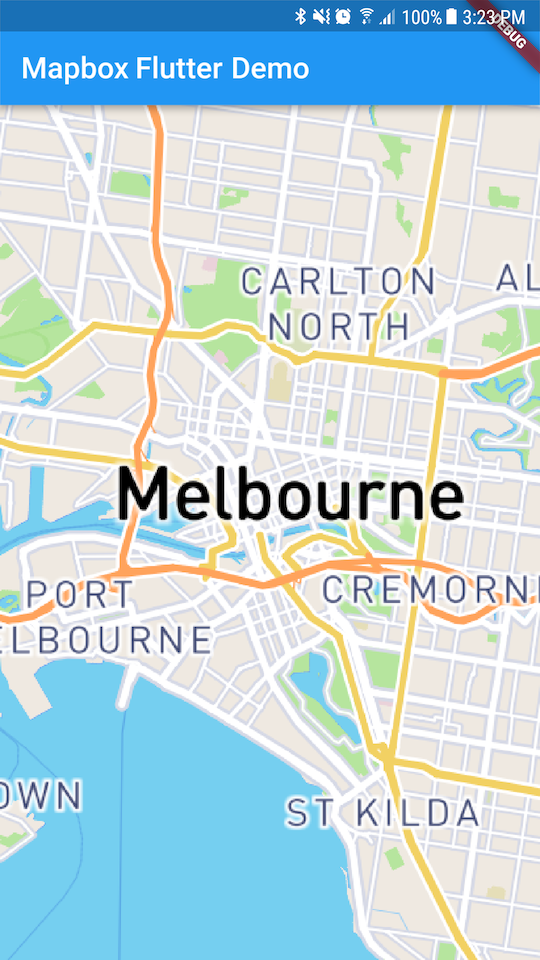

# Flutter Mapbox GL Native

> **Please note that this project is experimental and is not officially supported.** We welcome [feedback](https://github.com/mapbox/flutter-mapbox-gl/issues) and contributions.

A flutter plugin for [mapbox-gl-native](https://github.com/mapbox/mapbox-gl-native) that allows to
 embed interactive, customizable vector maps inside a flutter widget. Early development stage, only Android is supported for now.

## Getting Started
### Android

- Install [flutter](https://flutter.io/get-started/) and validate installation with `flutter doctor`
- Clone repository  with `git clone git@github.com:mapbox/flutter-mapbox-gl.git`
- Add `mapbox.accessToken="YOUR MAPBOX ACCESS TOKEN"`
 token to **flutter_mapbox/example/android/local.properties** 
- Run app with `cd flutter_mapbox/example && flutter run`